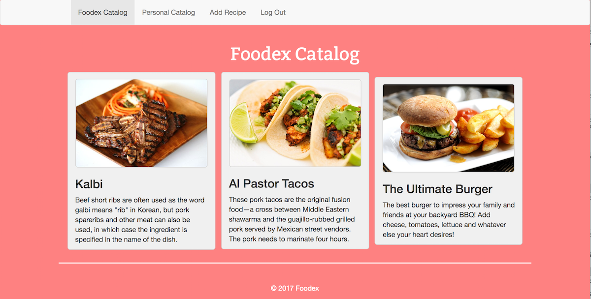
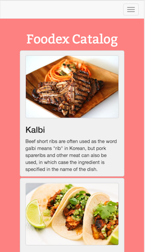

# Foodex: The Best Collection of Recipes on the Internet

## Available Now!
Sign Up Here
https://foodex-d5655.firebaseapp.com/hw5/templates/signUp.html
Already a Foodex Chef? Log In Here!
https://foodex-d5655.firebaseapp.com/hw5/templates/login.html

## What is Foodex?
Foodex is a web application that simplifies the process of adding, editing, and removing recipes from a personal cookbook, while also allowing registered users to view public recipes created by the Foodex community. The Foodex web application consolidates the actions of browsing, sharing, creating and editing recipes into one simple and friendly application.

## Application Overview
 * Frontend: HTML, Bootstrap, JavaScript (Vanilla, Vue)
 * Backend: Firebase
 * Accessibility: Chrome, Firefox, Mobile friendly

## Performance and UX
 * We took measures to ensure the best possible user experience in terms of RAIL (Response, Animation, Idle, Load)
 * Our Javascript and CSS files are bundled and minified to reduce byte count
 * Uploaded images are resized for consistency and to avoid huge files and longer load times
 * PWA/Offline Functionality: By leveraging technologies like Service Workers and the web app manifest, we have made our app more accessible to users with poor internet connectivity
 * Service workers allow us to cache the files necessary for a smoother offline experience. Note that caching must be enabled for this to work, and that the first site visit will cache the javascript, css and image files for our app.
 * Using a web app manifest allows us to define certain attributes and behaviors of our app that can be applied even when offline.

## Design and UX
 * Our goal was to make our UI as intuitive and simple as possible, so users don't have to spent their time reading instructions or tutorials - though we included these, in case it's not intuitive as we hoped (we are not the users!)
 * We chose what are known to be appetite enducing colors for our theme, so as to help our users get motivated to cook!
 

## Known Issues, Bugs, & Limitations
The Foodex Team is aware of a number of issues, bugs, and limitations:
 * The flow of page redirection when logging in with your Google account seems a bit janky, as you are redirect back from the Google account selection page to the Foodex login page before being taken to the home page. This is something that we are working on, but can't seem to figure out how to fix Firebase's Google authentication page flow.
 *
 
 
## Foodex Developers
For more information on the developers: https://foodex-d5655.firebaseapp.com/hw5/templates/team.html
  * Mauricio Panelo  
  * Dylan Uys  
  * Chang Gwoun  

