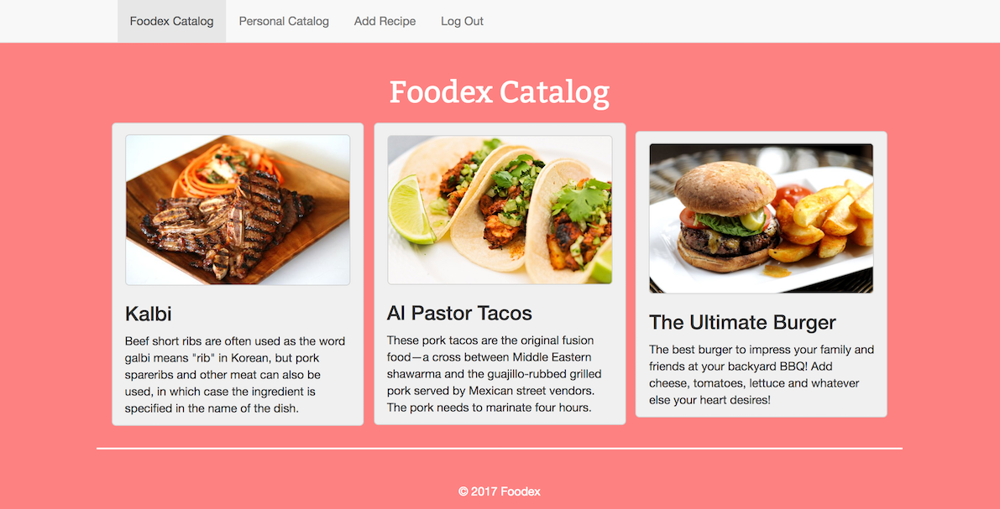

# Foodex: The Best Collection of Recipes on the Internet

## Available Now!
Sign Up Here
https://foodex-d5655.firebaseapp.com/hw5/templates/signUp.html

Already a Foodex Chef? Log In Here!
https://foodex-d5655.firebaseapp.com/hw5/templates/login.html

## What is Foodex?
Foodex is a web application that simplifies the process of adding, editing, and removing recipes from a personal cookbook, while also allowing registered users to view public recipes created by the Foodex community. The Foodex web application consolidates the actions of browsing, sharing, creating and editing recipes into one simple and friendly application.

 

## Application Overview
 * Frontend: HTML, Bootstrap, JavaScript (Vanilla, Vue)
 * Backend: Firebase
 * Accessibility: Chrome, Firefox, Mobile friendly!

 

## Usage
 * Create an account or log in - you can use your email address or your Google account
 * The Foodex Catalog page displays all public recipes that have been added by Foodex users
 * The Personal Catalog page shows all of your recipes, so it should be empty on your first visit.
 * The add recipe page allows you to add a title, time estimation, difficulty level, description, ingredients, instructions, a picture, and a visibility. If you set the visibility to public, your recipe will appear in the Foodex Catalog, viewable by all users. Setting it to private will ensure it only appears in your Personal Catalog. Don't worry about the image size, we resize it for you if it's too big :)
 * In the Foodex Catalog, clicking on any recipe image will take you to the recipe page, where you can view all the relevant information and cook away!
 * In the Personal Catalog, you have the ability to edit and delete any recipes that you have personally added.

## Performance and UX
 * We took measures to ensure the best possible user experience in terms of RAIL (Response, Animation, Idle, Load)
 * Our Javascript and CSS files are bundled and minified to reduce byte count
 * Uploaded images are resized for consistency and to avoid huge files and longer load times
 * PWA/Offline Functionality: By leveraging technologies like Service Workers and the web app manifest, we have made our app more accessible to users with poor internet connectivity
 * Service workers allow us to cache the files necessary for a smoother offline experience. Note that caching must be enabled for this to work, and that the first site visit will cache the javascript, css and image files for our app. Cache me outside.
 * Using a web app manifest allows us to define certain attributes and behaviors of our app that can be applied even when offline.

## Design and UX
 * Our goal was to make our UI as intuitive and simple as possible, so users don't have to spent their time reading instructions or tutorials 
 * We chose what are known to be appetite enducing colors for our theme, so as to help our users get motivated to cook!
 

## Known Issues, Bugs, & Limitations
The Foodex Team is aware of a number of issues, bugs, and limitations:
 * The flow of page redirection when logging in with your Google account seems a bit janky, as you are redirect back from the Google account selection page to the Foodex login page before being taken to the home page. This is something that we are working on, but can't seem to figure out how to fix Firebase's Google authentication page flow.
 * In the future, we would like to add features that provide more feedback to our users when the perform CRUD actions on our site, such as success or failure notifications or warnings.
 * Though we have private and public catalogs, we also want to improve the community aspect of Foodex. Future versions will allow you to see which users created which recipes, with a user profile interface. 

## Code Base Information
 * For the sanity of the grader, all of our homework assignments (code and hosted pages) are accessible from our index.html: https://foodex-d5655.firebaseapp.com/
 * For the final implementation of Foodex (HW5), our code is structured as follows:
 
 
 * sw.js (and the minified sw.min.js) contains our service worker code. It is placed in the root of hw5 to make it easier to define what scope the service worker controls.
 * templates contains all the html pages for our app, each of which corresponds to its own web page (this is not a SPA)
 * static contains our css (plain and minified), javascript (plain and minified) and images
 * static also contains the web app manifest

 
## Foodex Developers
For more information on the developers: https://foodex-d5655.firebaseapp.com/hw5/templates/team.html
  * Mauricio Panelo  
  * Dylan Uys  
  * Chang Gwoun  

